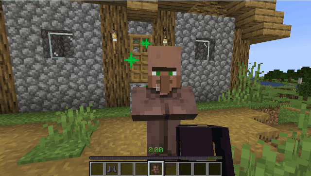
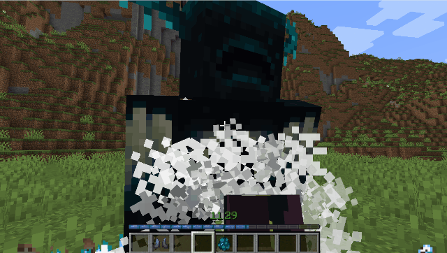

# One Kick

简体中文 | [English](README.md)

One Kick 是一款围绕“踢”展开的 Minecraft Forge/Neoforge 模组，添加了一系列相互联动且威力强大的附魔、炫酷的视觉特效与有趣的进度。

只要运用得当，就可以轻松一脚踢飞烦人的坚守者，或是一脚削平一座山头。

## 基本玩法

### 踢

1. 对准生物、方块或空气
2. 按下 R（默认）

### 机制

踢击力度与击飞速度为本mod的核心，决定了踢击的威力大小。

踢击力度由靴子品质、玩家移速、蓄力值与特殊魔咒综合计算；而击飞速度与踢击速度、目标最大生命值与击退抗性有关

## 附魔

本模组新增了一系列只能用在靴子上的附魔。原版精准采集现在也可以附魔到靴子上。若魔咒等级为`N`，则效果如下：

| 附魔 | ID | 稀有度 | 最高等级 | 作用 |
| --- | --- | --- | ---: | --- |
| 反作用 | `onekick:reaction` | 常见 | 1 | 踢生物或方块时产生与威力相对应的后坐力； |
| 空气动力学 | `onekick:aerodynamics` | 罕见 | 3 | 可以踢击空气`N`次造成后坐力 |
| 蓄力 | `onekick:charge` | 罕见 | 5 | 允许蓄力踢击，长按消耗饱食度以蓄力 |
| 超量充能 | `onekick:overcharge` | 非常罕见 | 2 | 提高蓄力上限`N`倍 |
| 角动量守恒 | `onekick:angular_momentum` | 罕见 | 1 | 让被踢飞的生物转起来 |
| 崩解 | `onekick:disintegration` | 罕见 | 1 | 被踢生物撞墙时造成方块破坏 |
| 不稳定碰撞 | `onekick:unstable_collision` | 非常罕见 | 3 | 撞击时爆炸（单独使用不会破坏方块） |
| 动能过载 | `onekick:kinetic_overload` | 非常罕见 | 3 | 大幅提高踢击速度、撞击伤害与破坏效果 |
| 精准采集（原版） | `minecraft:silk_touch` | — | 1 | 踢击破坏的方块将100%掉落且具有精准采集效果 |

+ 除蓄力过程会消耗饱食度外，蓄力踢击还会额外消耗饱食度。若踢击时饱食度不足，则威力会按比例衰减。
+ 在某些组合下，你的蓄力可能会极速消耗饱食度，甚至需要蓄力中途进食才能发挥出最大威力。
+ 动能过载魔咒具有极高的数值，会使任何踢击变得危险并具有破坏性，在家里操作时需要小心。

## 附魔联动

以上所有附魔可以以任意方式组合并正常发挥各自的效果，魔咒等级越高，威力越大；两两之间没有冲突，且威力会相互增幅；此外存在以下特殊联动效果

| 组合 | 实际效果 |
| --- | --- |
| 崩解 + 动能过载 | 撞击会造成长度极大的大规模方块破坏 |
| 崩解 + 不稳定碰撞 | 撞击爆炸会按不稳定碰撞的逻辑进行破坏方块；禁用崩解附魔的破坏效果 |
| 崩解 + 不稳定碰撞 + 动能过载 | 撞击将造成长度极大、半径较大的大规模方块破坏与爆炸 |

## 配置与指令

指令需要权限等级 2。

| 指令 | 作用 |
| --- | --- |
| `/onekick kinetic_overload_drop_protection true` | 启用（动能过载踢击造成的破坏不再掉落物品 ） |
| `/onekick kinetic_overload_drop_protection false` | 关闭（按本mod规则掉落） |

指令即时同步服务端配置文件 `serverconfig/onekick-server.toml`的`performance.suppressKineticOverloadBlockDrops`。

数据包和其它模组可以修改这些标签以配置本mod效果：

| 标签 | 默认内容 | 用途 |
| --- | --- | --- |
| `onekick:entity_types/kick_immune` | `minecraft:ender_dragon` | 不能被踢飞 |
| `onekick:entity_types/flying` | 悦灵、蝙蝠、蜜蜂、烈焰人、末影龙、恶魂、鹦鹉、幻翼、恼鬼、凋灵 | 不会被角动量守恒转起来；原版 `FlyingMob` / `FlyingAnimal` 同样排除 |
| `onekick:blocks/disintegration_immune` | `#minecraft:wither_immune` | 不能被踢击破坏 |
| `onekick:blocks/disintegration_direct` | 玻璃、玻璃板、`#minecraft:leaves`、`#minecraft:wool` | 直接碎裂，不生成飞散碎块 |

## 注意事项

+ 目前尚未针对附魔稀有度进行调整，因此可能会导致本mod魔咒过于稀有或过于常见，如遇问题请反馈
+ 本mod偏娱乐，数值多为二次曲线增长，并不适配原版生存，可能会导致数值崩坏；

> [!WARNING]
>
> 目前踢击力度与击飞速度没有设置上限。虽然本mod针对动能过载造成的大规模方块破坏进行了性能优化，但不保证在不同配置下，特别是通过特殊方法获取到超出本mod原魔咒最高等级的附魔时的表现，请谨慎操作。

## 致谢与声明

本mod的核心玩法受视频 https://www.bilibili.com/video/BV1m19YBuEjp/ 的部分内容启发而来，在此特别感谢原作者：[@老丹Daniel](https://space.bilibili.com/26947053) [@空栈不是空伐](https://space.bilibili.com/291397844)；本mod功能为自行编写实现，仅参考创意。

One Kick 使用 [MIT 许可证](LICENSE)
